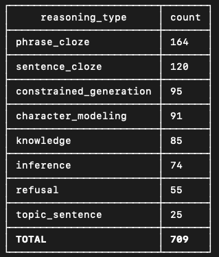

Experiment plan
===============

Okay, I've organized all the questions (we have 709!) and have written (okay, co-written with Claude) the benchmark evaluation code. 

Now, I'm going to test a bunch of models on the benchmark and report results to the team. But this is not just random testing. Our agenda here is not primarily to evaluate the models, after all: it's to understand the benchmark. So I understand this as a kind of experiment. It's exploratory in character rather than strict hypothesis-confirmation, but we do have expectations and I should formalize them before running the test.

## Expectations

Fundamentally:

+ **H1**: We expect metadata permutation to harm performance, and
+ **H2**: Especially expect performance to be harmed in particular subsets of the benchmark: the reasoning_type "constrained_generation" and frame_type 'book_context'.
+ **H3**: We also, more weakly, expect fine-tuning a model on period text to improve performance on some parts of the benchmark. It may or may not improve performance overall, but we expect improved performance on reasoning_types 'phrase_cloze' and 'sentence_cloze' at least. We also expect that the positive effects of fine-tuning will increase with answer_length.
+ **H4**: Performance on the "inference" subset will increase with model size, and will be higher in reasoning models than in instruct models -- with base models bringing up the rear.
    
But wait, what are these reasoning types and answer lengths? I've done some organizing of the benchmark questions to make a coherent experiment possible.

## New fields in the benchmark

Our existing question_types were in many cases describing *how a question was constructed or sourced* rather than *what the model was being asked to do.* E.g., we have question_types like 'textbook', 'handcrafted', and 'poetry', which really describe sources or processes of construction.

Also, there was a deep ambiguity in the metadata_frames. How much information do we need to provide? If it's a knowledge question from an encyclopedia, maybe just date. If it's a parallax question, more about the book and author. What's going on there?

To give this a better intellectual structure, we have three new fields: frame_type, reasoning_type, and answer_length.

### Frame_type

Allowable frame types are 'world_context', 'book_context', and 'passage_context'.

**World context** is what we've been providing for encyclopedias and similar reference books. A typical example: "This question requests information from a British encyclopedia published in 1910; your answer should reflect the state of the world at that time."

**Book_context** is what we've been providing for parallax questions, and some others. It's often expressed as "the correct answer to the following question will be drawn from book B." E.g., ""The correct answer to the following question is drawn from History of Education in India Under the Rule of the East India Company, a history published in 1922 by Baman Das Basu, an Indian physician, nationalist, and historian. It will fit Basu's likely perspective on the question."

**Passage_context** describes the additional contextual clues present in cloze questions, where the model has part of a passage and needs to fill in a masked section. The metadata frame may contain the same information as book_context, but it is typically expressed as "The following passage is drawn from book B," rather than "the correct answer is drawn from book B."

I hope these distinctions help us express the different kinds of tasks that confront the benchmark.

### Answer_length

This is pretty straightforward. There's reason to expect fine-tuning to have more effect on longer answers.

So questions have been divided into three categories, based mostly on median answer length: 'short_answer', 'phrase', and 'sentence_plus.' (I say mostly because all 'clause' questions went to 'phrase.')

We could also just use literal median answer length to analyze results.

### Reasoning_type

This field aligns in many places with the old question_category field, but I hope it will do a better job of characterizing the *question,* not the source.

Allowable reasoning_types are:

1. **knowledge** This will include attribution as well as most, but not all, questions currently characterized as 'knowledge.'

2. **abstention** The old "refusal" — knowledge questions where the right answer is some version of "There is insufficient information in this historical context to answer the question." Or "the question doesn't make sense."

3. **inference** This will include some questions from handcrafted, textbook, and knowledge. Essentially, it includes questions where the right answer requires not just recall, but multi-step reasoning over information. Some benchmarks would distinguish pure reasoning -- e.g. a math word problem where all needed info is ostensibly in the question -- from something like "Which is longer, the Congo River or the Rhine River?" which requires both memory and comparison. We don't distinguish those two questiontypes, for reasons to be discussed. (Preview of one reason: "ostensibly.") Questions that require recognizing and describing poetic form are also in "inference."

4. **character_modeling** (both with and without summary)

5. **constrained_generation** This now includes parallax and poetry_generation, as well as questions from letter-writing textbooks that require writing an invitation, etc. The constraints include both form constraints ("write a quatrain," "write a sentence that uses the word liberal") and metadata constraints "Correct answer will come from a book that ..."

6. **topic_sentence** Straightforward. Questions with headless paragraphs that require a topic sentence.

7. **phrase_cloze** From (batch)connectors.

8. **sentence_cloze** From (batch)connectors.

Fortunately the frame_type can be inferred from the reasoning_type.

    knowledge => world_context
    refusal => world_context
    inference => world_context
    character_modeling => book_context
    constrained_generation => book_context
    topic_sentence => book_context
    phrase_cloze => passage_context
    sentence_cloze => passage_context

Here are the numbers of questions in different categories

## What happens next

I'm going to try to test several models on the benchmark: a base model, several instruct models of different sizes, and also at least one open and one closed sota reasoning model.

This will tell us how performance varies with model size and type. I expect (H4) size and reasoning to improve performance especially on the knowledge and (especially!) inference parts of the benchmark.

I'll also test (at least some of) these models on a metadata-permuted version of the benchmark. Metadata frames will be permuted *within* frame_types. Additionally, the character_modeling set will be permuted separately. So we permute within 1) world_context, 2) character questions, 3) topic sentence + constrained_generation, and 4) the cloze / passage_context questions. 

This addresses H1 and H2.

I'll also test fine-tuned Qwen 2.5 on the model, addressing H3.
