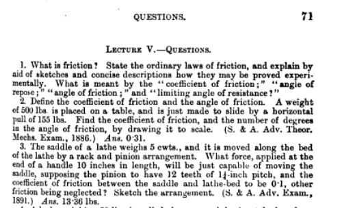

# English-Language Pipeline Update

The main readme file in this directory provides an overview of pipeline strategy and corpus development. This file is aimed specifically at changes in Dec-Jan 25/26, for people who have some previous exposure to the pipeline.

## main strategy shift

The key general change is that I adjusted strategy so that it doesn't lean as heavily on an initial LLM pass (or multiple LLM passes!) over the entire corpus to extract appropriate passages. We were having trouble getting good accuracy with small models. In theory that wasn't a terrible problem, because we anticipated a manual approval step to filter the final questions. But in practice, as I started forming questions, I realized that it was often important to have *collections of parallel entities/sentences* from the text that could be used automatically as distractors. If initial accuracy was low, these, too, would be unreliable.

Also, more fundamentally, there was just no important reason *not* to use a simpler strategy for the initial filter. The risk of a simple strategy is, for instance, that we might miss some subtle edge cases exemplifying a specific rhetorical category. But the goal of categorization in this benchmark is usually not that we're interested in the category itself. It's rather that we need some categories -- any categories -- to provide a structure other than simple fill-in-the-blank.

For instance, the ```connectors/``` module identifies "sentences describing an effect or inference" using these rules:

**as first word:** so, hence
**in first five words:** thus, therefore, thence, accordingly, consequence, result, effect, consequently, it follows that

In using those rules we will get some false positives. Those can be filtered manually; in some cases there's also an initial LLM pass to filter ambiguous words like "so" or "since" or "while" (which have a temporal as well as a causal sense). False positives are important to exclude.

We will also get some false negatives: we will miss some cases where a cause-effect or premise-inference relation between two sentences is implicit and unstated. But the false negatives don't particularly matter. We're not writing a paper on causal rhetoric in 19th-century English prose, where it's vital to catch subtle edge cases. In framing a benchmark, we simply need a category of sentences where logical relations are clear so we can tell a model "the missing sentence describes an effect or inference" and give it a chance to go beyond simple cloze by taking advantage of multiple kinds of evidence. We want to challenge the model, not mainly by giving it especially subtle edge cases of causation, but by giving it some sentences where the right answer requires *an ability to produce 19c/20c prose in response to specifications that may be expressed in 21c terms.* That's the mission.

So this version of the English pipeline often relies on simple NLP strategies (SpaCy or the like) to identify entities, clauses, or sentences in a period text that could function as a ground truth answer. It may then use language models to do some filtering or summary, or to write the final question.

An exception to the rule here is the ```character/``` module which does use small language models to make two initial passes over a book (one extracting character descriptions, another character dialogue), before pairing descriptions with dialogue to form questions about characters.

The language models I have used most heavily are mistral-small:24b, and gpt-oss:20b. To be blunt, I used them because they run on my Macbook Pro with 64GB, and that made things easier. The Mistral is more reliable. GPT-OSS is a thinking model, and it often thinks too long, causing answer overflow. It's also quite flowery when asked to imitate the past, which is sort of fun and produces some colorful distractors. The ```connectors\``` module generates anachronistic distractors using both models for variety.

You might prefer other models! For the Chinese-language benchmark it will of course be important to use models that are good in Chinese, and ideally able to understand a range of scripts and linguistic registers.

## things not yet solved

It's important not to give our test-taking models simple clues that they can take advantage of to discern the right answer. Right now, this remains a bit of a challenge for our "anachronistic distractors" (wrong answers produced by contemporary language models).

Two specific challenges are

1. Ensuring that the average length of anachronistic distractors is comparable to ground truth.
2. In ```connectors/``` we need to ensure that anachronistic distractors are as likely as ground truth to contain the logical connectors that serve as trigger words.

There's also a general puzzling question about *how much information* to give the models when they produce distractors. For instance, do we provide the metadata_frame for the question, so the model can try to match date, genre, etc? Right now I have solved this in ```connectors/``` by producing one anachronistic distractor where the model did see the metadata, and one where it didn't. (They are labeled.) In the Chinese-language benchmark, it might be quite important whether we explicitly tell the model to produce a literary or vernacular response (matching the register of the source), or allow it to be wrong. I don't know which approach is preferable.

3. An edit I need to make to the pipeline code: I think it's a good idea to store, with each question, the *number of words* in the question text drawn from our period source, and the *number of words* created by a contemporary model or human. This may be useful analytically as we strive to understand the performance of models that have more or less exposure to different periods. Right now we know which distractors are period or anachronistic. But we don't have that information about question text.

## categories of questions, with examples

We have right now ~240 questions, mostly in ```character/```, ```connectors/```, and ```knowledge```. The knowledge questions at present all come from one encyclopedia in 1897. We'll broaden that out so we have another group from the 1870s and another group from 1918. But knowledge questions will always be a little clumpy across the date axis. We may eventually have 250 or so of these.

We have almost 100 character questions. That's probably about as many as we need for ten fiction volumes. 

I expect to produce two or three hundred more questions in ```manual/```, distributed across textbook, attribution, and a range of other handcrafted types. 

The number of questions in ```connectors/``` could grow much larger, because it's a flexible and widely applicable process. It would be relatively easy to get ~800 questions here. I also think there is a good rationale for having a lot of questions in this category. They are semi-cloze questions, and the way I understand model assessment right now is that cloze is the foundation on which we must build. We want to go beyond it! But capacity to do cloze has to be there: it implicitly captures a wide range of knowledges and skills that we could never aspire to enumerate explicitly.

I also think we can get perhaps 100 or 200 summary questions using the workflow we developed last semester, which identifies "topic sentences" in paragraphs and uses them as period-authentic summaries.

So the total number of questions for EN_1875-1924 will be between 1500 and 2000. Is that enough? I think so but a literature review of other benchmarks might help us decide. Keep in mind that 1875-1924 will not be the only part of ChronoLogic_EN.

Our treatment of categories will be flexible: we can macro-average them as units as well as micro-averaging across individual questions. So the number of questions in a category does not necessarily determine its weight in evaluation.

### knowledge questions

**Source HTID:** hvd.hn5bs8

**Source Title:** Columbian Cyclopedia, vol 23

**Question Category:** knowledge

**Context:** In answering the following question, assume that it has been posed in 1897: 

**Question:** In what year did the New York Magazine begin publication?

**Answers:**

| Type | Answer | Prob |
|:-----|:-------|-----:|
| ground_truth | 1790 | 1.0 |
| manual_anachronistic_distractor | 1968 | 0.0 |
| manual_distractor | 1848 | 0.0 |
| manual_distractor | 1850 | 0.0 |

### character questions

This illustrates how flowery gpt-oss can get, but unfortunately also the challenge we're having keeping anachronistic distractors to the same length as ground truth.

**Source HTID:** hvd.hnnwy1

**Source Title:** The Barrys

**Question Category:** character_modeling_with_summary

**Context:** This question asks you to provide dialogue for a character in a book. The book in this case is a novel published in 1899 by Shan F. Bullock, a Irish writer born in 1865.

**Question:** The character in question here is John Butler, who is described this way in the book:
"He was a big man, with a square, ruddy face; the mouth large and mobile, the chin weak and flabby. His eyes were bright and kindly, his nose large, his head crowned with a shock of brown hair.", "old John was asleep, chin on breast and his lips dribbling.", "big John, hands in pockets, shoulders slouched, hat on the back of his head; goes shambling along, without care or purpose, just lounging about in the sunshine", "His face shone red as a coal. His eyes flared.", "John's face was solemn; one hand gripped his pipe stem, the other swung limply to and fro.", "Ould John, still clutching his pipe, had fallen asleep.", "John was a big, soft-handed, blethering Irishman, one who wanted work yet loathed it, spoke one thing and meant the other, said he was this and looked that."

At one moment in the book, John passionately debates Ireland with Frank, Nan, and Ted while they listen. Write a short passage of dialogue (1-3 sentences) that John Butler might speak in this situation:

**Answers:**

| Type | Answer | Prob |
|:-----|:-------|-----:|
| ground_truth | Who would save Ireland, sir? Would England, sir? Would politicians, sir? | 1.0 |
| same_character | You'd be thinkin a power, Frank, o' the poetry o' Pope, I'm thinkin? | 0.0 |
| same_book | Well, I'm for there too, if you don't mind taking me. | 0.0 |
| anachronistic_gpt-oss:20b | Listen, ye lads, Irelands not a dream but a fight, a breath that must be kept in our throats! We can't let the English take our soil and our hearts, we must stand up and make them hear the roar of the green! If we don't, the next generation will be born with no tongue to speak of the Emerald. | 0.0 |

### logical connection questions

**Source HTID:** hvd.hwwjnq

**Source Title:** Argentina

**Question Category:** cloze_contrastclause

**Context:** The following passage comes from Argentina, a work of history and social description published in 1910 by W. A. Hirst, an American writer.

**Question:** France makes steady progress, and Italy shows a large increase, as is only to be expected, because the emigration from Italy has long been very large. It may be added that French goods make their way by sheer merit, for France has in her own land ample scope for her scanty population. Some advantage may be obtained by her as the head of the Latin race, [masked clause revising an implied expectation]. It is very interesting to see how Argentina has passed from small to great things in matters of trade.

Write a clause appropriate for this book that could stand in the position marked by [masked clause revising an implied expectation]:

**Answers:**

| Type | Answer | Prob |
|:-----|:-------|-----:|
| ground_truth | but wherever there are women and luxury there will French trade flourish, and further, in machinery of many kinds France, if equalled by any other nation for excellence, is equalled by England alone | 1.0 |
| negation | but wherever there are scarcity and simplicity, French trade will wither, and further, in machinery of many kinds, France, if surpassed by any other nation for excellence, is surpassed by England alone | 0.0 |
| same_book | but it is a peculiarity about Argentina that the people hurry to institute a great export trade long before they think of supplying themselves adequately with an article | 0.0 |
| same_book | but the third view is naturally that of Argentina, which is every year receiving an abundant stream of white colonists to develop the industries which cry aloud for labour | 0.0 |
| anachronistic_mistral-small:24b | but her influence is tempered by the fierce competition from other nations within Latin America. | 0.0 |
| anachronistic_metadataless_gpt-oss:20b | even as its resources are comparatively scarce | 0.0 |

### questions directly drawn from period textbooks

In the first question below, note that the period textbook lists the answer in pounds, lbs, where a modern engineer (or language model) would specify lbf to show that pounds of force/weight, and not of mass, are at issue. The unit cwt (hundredweight, 112 lbs) is also specific to nineteenth-century British engineering.

**Question Category:** textbook

**Context:** The following question is drawn from A Text-book on Applied Mechanics : Specially Arranged for the use of Science and Art, City and Guilds of London Institute and Other Engineering Students, a textbook published in 1895 by Andrew Jamieson, a Scottish professor of electrical engineering.

**Question:** The saddle of a lathe weighs 5 cwts., and it is moved along the bed of the lathe by a rack and pinion arrangement. What force, applied at the end of a handle 10 inches in length, will be just capable of moving the saddle, supposing the pinion to have 12 teeth of 1 1/4-inch pitch, and the coefficient of friction between the saddle and lathe-bed to be 0.1, other friction being neglected?

**Answers:**

| Type | Answer | Prob |
|:-----|:-------|-----:|
| ground_truth | 13.36 lbs | 1.0 |
| anachronistic_manual | 13.4 lbf | 0.5 |
| manual | 50 cwts | 0.0 |
| manual | 24 kg | 0.0 |
| manual | 50 lbs | 0.0 |



**Source HTID:** hvd.hx5bww

**Source Title:** Code Standard English Grammar

**Question Category:** textbook

**Context:** The following question is drawn from Code Standard English Grammar, a textbook published in 1883 by C. P. Mason, a British writer.

**Question:** Make a single sentence out of the following pair of sentences by using a relative pronoun. 1. I heard some news. 2. The news astonished me.

**Answers:**

| Type | Answer | Prob |
|:-----|:-------|-----:|
| ground_truth | I heard some news that astonished me. | 1.0 |
| manual | I heard some news, and the news astonished me. | 0.0 |
| manual | The news these days is astonishing. | 0.0 |
| manual | I was astonished by the news. | 0.0 |

### manual attribution questions

**Source HTID:** attribution

**Source Title:** Cheltenham Chronicle

**Question Category:** attribution

**Context:** 

**Question:** The text that follows comes from a newspaper article in The Cheltenham Chronicle. "There was an exciting scene in the First Volksraad on Thursday, when the State Secretary read a communication from Sir A. Milner in reply to the Transvaal Government’s request for an explanation of the mobilisation of British troops on the frontier of the South African Republic. The High Commissioner’s reply was to the effect that the troops were to safeguard British interests, and in preparation against contingencies. President Kruger urged the members of the Raad to moderate the tone of their remarks. In the discussion several members warned the Government to be prepared, as war seemed inevitable. Mr. Tœbs said he considered the explanation of Sir A. Milner was equivalent to a declaration of war by Great Britain." This article was likely published in

**Answers:**

| Type | Answer | Prob |
|:-----|:-------|-----:|
| ground_truth | the 1890s | 1.0 |
| manual | the 1880s | 0.5 |
| manual | 1900-09 | 0.5 |
| manual | the 1870s | 0.0 |
| manual | the nineteen-teens | 0.2 |
| manual | the 1920s | 0.0 |

**Source HTID:** attribution

**Source Title:** Paradise Lost

**Question Category:** attribution

**Context:** 

**Question:** Who wrote the epic poem that begins "OF Mans First Disobedience, and the Fruit / Of that Forbidden Tree, whose mortal tast / Brought Death into the World, and all our woe, / With loss of Eden, till one greater Man / Restore us, and regain the blissful Seat, /Sing Heav'nly Muse"?

**Answers:**

| Type | Answer | Prob |
|:-----|:-------|-----:|
| ground_truth | John Milton | 1.0 |
| manual | Paradise Lost | 0.0 |
| manual | John Stuart Mill | 0.0 |
| anachronistic_manual | Stanley Fish | 0.0 |

### other hand-crafted questions

**Source HTID:** hvd.hc16zc

**Source Title:** Gould and Pyle's Cyclopedia of Practical Medicine and Surgery, With Particular Reference to Diagnosis and Treatment

**Question Category:** handcrafted

**Context:** This question is about Gould and Pyle's Cyclopedia of Practical Medicine and Surgery, With Particular Reference to Diagnosis and Treatment, a reference work published in 1912 by George M. Gould, an American physician.

**Question:** In 1912, what would a physician call the chemic basis of the nucleus, consisting of a complex proteid base and an acid?

**Answers:**

| Type | Answer | Prob |
|:-----|:-------|-----:|
| ground_truth | nuclein | 1.0 |
| anachronistic_manual | DNA | 0.0 |
| anachronistic_manual | deoxyribonucleic acid | 0.0 |
| manual | protoplasm | 0.0 |